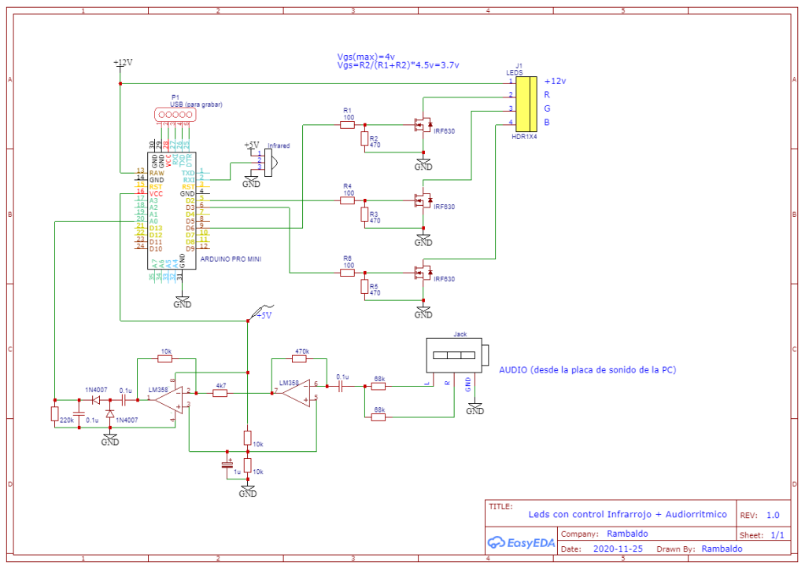
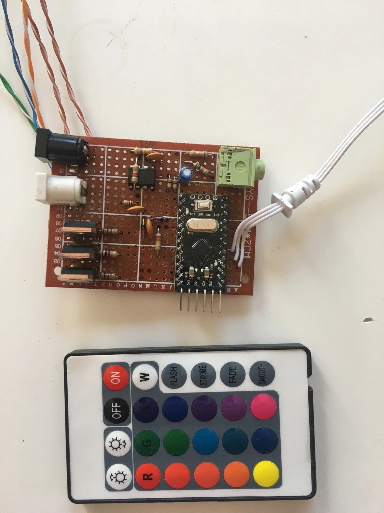

```
  ___              _  _                 
 / _ \            | |(_)                
/ /_\ \ _   _   __| | _   ___           
|  _  || | | | / _` || | / _ \          
| | | || |_| || (_| || || (_) |         
\_| |_/ \__,_| \__,_||_| \___/          
 _____ ______   _                _      
|_   _|| ___ \ | |              | |     
  | |  | |_/ / | |      ___   __| | ___ 
  | |  |    /  | |     / _ \ / _` |/ __|
 _| |_ | |\ \  | |____|  __/| (_| |\__ \
 \___/ \_| \_| \_____/ \___| \__,_||___/

        © Javier Rambaldo 2020/2025 ©
```                                     
                                        
# audio-ir-leds
Leds con control remoto infrarrojo + audiorritmico.

Usando Arduino Mini + LM358 para amplificar y rectificar el audio.

Maneja una tira de Leds RGB.

[Lo podes encontrar acá: micro57.wordpress.com](https://micro57.wordpress.com/2020/12/05/leds-rgb-audiorritmicos/)


# Descripción

Este control de luces RGB para tira de LEDS no es el mismo que ya existe comercialmente. Este tiene agregados de programas que no son estándars, como un flash que permite seleccionar el color o un pulso de flash suave, como un latido de corazón. Pero lo más extravagante es un control de brillo que se acciona mediante la música.

Está realizado con un Arduino pro mini y un LM358 para amplificar el audio. Cuenta también con 3 transistores Mosfet de 10 A que nos permite agregarle hasta 10 metros de tiras de leds tipo 5050 o el equivalente a 600 leds.

Adicionalmente posee un control infrarrojo para poder cambiar los diferentes programas y efectos de luces.

# Funcionamiento de las teclas del remoto

- El Smooth si se prende va barriendo los colores en cualquier momento, por ejemplo, en el flash, strobe o audiorritmico.
- El Strobe es un flash del color negro al color seleccionado.
- El Flash es de negro a blanco.
- El Fade es un flash suave, del negro al color seleccionado. Por ejemplo, si se usa rojo parece el latido del corazón,
- La tecla W es el audiorritmico.
- Las fechas arriba y abajo suben y bajan el brillo, pero si está seleccionado el flash o el strobe funcionan como velocidad de parpadeo.
- El audiorritmico no tiene efecto, ya que el brillo cambia al compas de la música.

### Compuerta de sonido y control automático de ganancia:

- El audio que ingresa por la entrada analógica A0 es procesado por un control automático de ganancia, que determina los máximos y mínimos de la señal y con esto marca un rango de tensión a trabajar.

- Por supuesto que la música es muy cambiante y estos límites pueden variar, es por esto que se agregó un control que mueve los límites max y min al centro de la seña (los normaliza) para que vuelva a medirse otros extremos.

- También cuenta con un control de NO AUDIO o sea que si el audio es muy bajo, apaga los leds para que no quede el sistema oscilando con un destello muy molesto en los leds.


# Circuito



# Terminado

